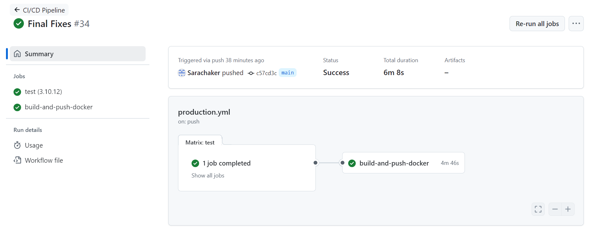

# 📌 **User Management System - Final Project**

A modern **FastAPI**-based microservice for user management, featuring:

- **User Registration & Authentication** (JWT-based)
- **Role-based Access Control** (Admin, Manager, Authenticated, Anonymous)
- **Email Verification** with token-based workflow
- **Password hashing** and **strength validation**
- **Profile picture URL validation**
- **Nickname generation** fallback
- **PostgreSQL** database integration (via SQLAlchemy Async + asyncpg)
- **Dockerized** for local development & production
- **Nginx** reverse-proxy configuration
- **Automated tests** with pytest & CI pipeline
---

## ✨ **Key Features and Contributions**

* ✅ **MinIO Profile Picture Upload**
  Implemented secure and efficient uploading and retrieval of user profile pictures using MinIO cloud storage.

* ✅ **Comprehensive Quality Assurance**
  Identified, documented, and resolved **5 critical QA issues** improving the application's reliability.

* ✅ **Extensive Test Coverage**
  Developed and integrated **10 new automated tests** covering edge cases, error handling, and essential functionalities, significantly enhancing code robustness.

* ✅ **CI/CD Automation**
  Configured GitHub Actions for automated testing, Docker image builds, and continuous deployment, ensuring seamless deployability.

* ✅ **Docker Hub Deployment**
  Successfully deployed and hosted the application Docker image publicly on Docker Hub.

---
## 🛠️ Implemented Issue Fixes

| Issue | Description | Status |
|-------|-------------|--------|
| **[#1](https://github.com/Sarachaker/user_management/issues/2)**: Dockerfile libc-bin downgrade error | Allowed `--allow-downgrades` for glibc patch | ✔️ Fixed |
| **[#2](https://github.com/Sarachaker/user_management/issues/3)**: Profile picture URL validator | Ensured URLs end with `.jpg|.jpeg|.png` | ✔️ Fixed |
| **[#3](https://github.com/Sarachaker/user_management/issues/4)**: Nickname generation bypass | Always run generator when nickname missing | ✔️ Fixed |
| **[#4](https://github.com/Sarachaker/user_management/issues/5)**: Email verification role logic | Prevent `AUTHENTICATED` from re-verifying | ✔️ Fixed |
| **[#5](https://github.com/Sarachaker/user_management/issues/6)**: Weak password acceptance | Added Pydantic validator for strength rules | ✔️ Fixed |

---

## 🛠️ **Technology Stack**

* **FastAPI** for robust backend development
* **PostgreSQL** as the relational database
* **MinIO** for cloud-based profile picture storage
* **Docker & Docker Compose** for containerized application deployment
* **GitHub Actions** for CI/CD automation
* **pytest** for comprehensive unit and integration testing

---

## 📦 **Docker Deployment**

My application is deployed and ready-to-run via Docker Hub.
📌 **Docker Hub Link:** \https://hub.docker.com/repository/docker/sarachaker/user_management/general

To run locally:

```bash
docker-compose up --build
```

---

## 📸 **Project Screenshots**

* CI/CD pipeline passing on GitHub Actions

  ```
  
  ```

* Docker Hub deployment confirmation

  ```
  
  ```

* Profile picture upload feature (MinIO Integration)

  ```
  
  ```

* Test Coverage summary/report

  ```
  
  ```

---

## 📝 **Reflection Document**

Please refer to the [Reflection Document](./Final Reflection Paper IS601.docx) for an in-depth review of my project journey, issue resolutions, test coverage strategy, feature implementation details, and personal learnings.

---

## 📌 **Grading Criteria Met**

| Criteria               | Status      |
| ---------------------- | ----------- |
| Reflection Document    | ✅ Completed |
| QA Issues (5 total)    | ✅ Completed |
| New Tests (10 total)   | ✅ Completed |
| Feature Implementation | ✅ Completed |
| Deployability (Docker) | ✅ Deployed  |
| Commit History (≥10)   | ✅ Fulfilled |

---

## 💡 **Next Steps and Future Enhancements**

* Further optimization and performance improvements.
* Enhanced UI for easier user management.
* Additional authentication methods (OAuth integration).

---

## 📬 **Contact**

If you have any questions or feedback, please reach out:

* GitHub: [Sarachaker](https://github.com/Sarachaker)

---